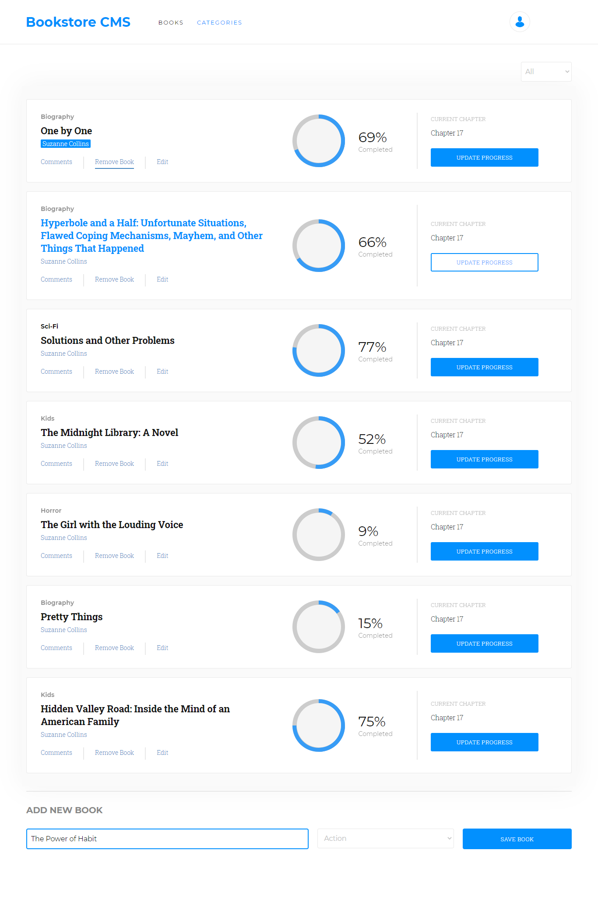

# Bookstore React App

Bookstore app built using React and Redux. The project consists of the front-end of an application that will help to organize and manage bookstore. As the app should be fast, dynamic and responsive to the actions, it is built using React & Redux.

## Screeenshot

## Built With

- create-react-app
- React JS
- Redux
- Heroku
- create-react-app-buildpack
- Zeplin

## Live Demo

[Live demo](https://polar-citadel-29411.herokuapp.com/)

## Getting Started

- Fork the repository and create a local one on your computer
- Move to the repository inside the command line using cd and the path to the file
- Run npm start on your command line.

## Authors

👤 Nurislam Ab
- Github: [@nurislam-ab](https://github.com/nurislam-ab)
- Linkedin: [nurislam-ab](https://www.linkedin.com/in/nurislam-ab/)
- Twitter: [@NurislamAb](https://twitter.com/NurislamAb)

## 🤝 Contributing

Contributions, issues, and feature requests are welcome!

Feel free to check the [issues page](issues/).

## Acknowledgments

* Microverse

## Show your support

Give a ⭐️ if you like this project!

## 📝 License

This project is [MIT](LICENSE) licensed.
